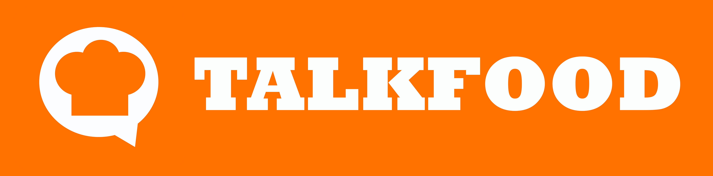
# Manual de Usuario

Si los programadores pueden tener Stackoverflow y Github para compartir soluciones y ayuda remota, porque no también los amantes de la cocina, seguro todos conocemos a alguien que estaría feliz de poder tener diversas recetas de cocina para estar probando nuevos gustos e innovando su menú en casa por simple placer o amor a los suyos. Seguro en algún lugar del mundo alguien agradecería tener las recetas de las pupusas salvadoreñas incluso para poder tener un emprendimiento en su país. 

## ¿Qué es Talkfood?
TalkFood es una red social para chefs y amantes de la cocina que deseen adquirir y/o compartir conocimientos en las artes culinarias.

## Especificaciones técnicas
Para la Implementación de Talkfood requerimos lo siguiente:
1. Acceso a internet
2. Una computadora conectada a la red local. 
3. Un navegador instalado.
 *Es recomendable utilizar los navegadores que permitan utilizar JavaScript y Cookies.*

## Funcionalidades principales
¿Qué me permitirá hacer talkfood?
- Publicar sus recetas.
- Consultar las recetas compartidas por otros usuarios; donde todos podrán compartir fotos y pasos de lo que hacen para preparar una receta
- A través de comentarios realizar sugerencias, además dejar sus valoraciones a la persona que compartió su receta.
- Permitirá la adquisición de nuevas recetas e incluso un intercambio cultural culinario entre los diversos manjares de muchos países.

*"La misión es permitir que todos encuentren inspiración para cocinar en casa a través de las diferentes recetas que todos los usuarios van a compartir."*

## Menús
¿Para qué sirve cada menú?
- Este es el menu principal en la barra de navegación, en el cual se tiene acceso a

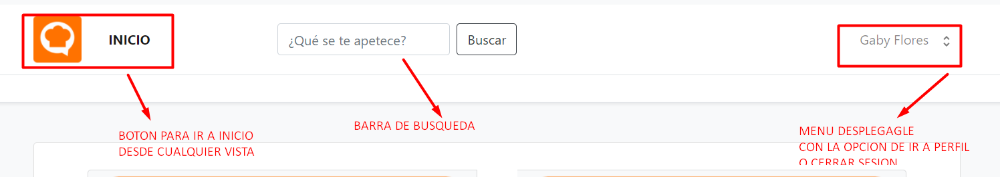

- En el menú desplegable, desde esta opción se accede a la vista de perfil:

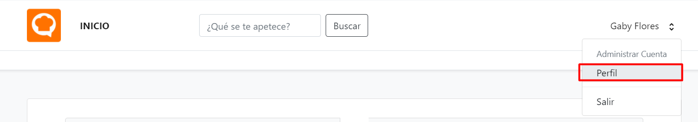

- La vista de perfil contiene un submenú que se compone de la siguiente manera:

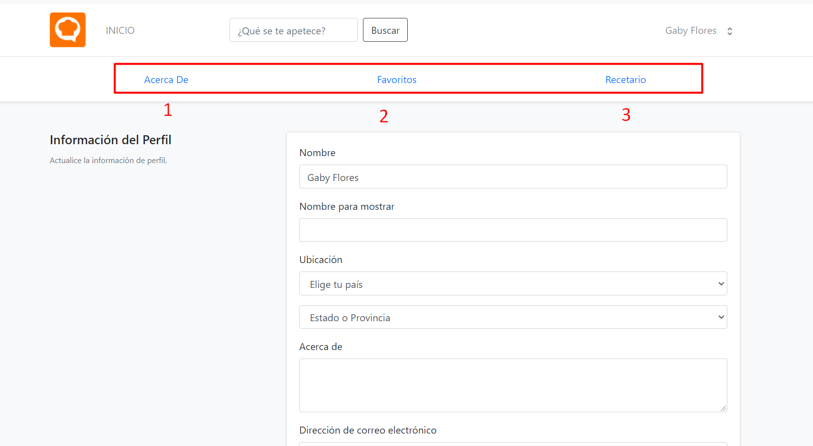

***Composición del submenú que se encuentra al estar en perfil***
- Vista de Acerca de (con información del usuario al que pertenece la cuenta)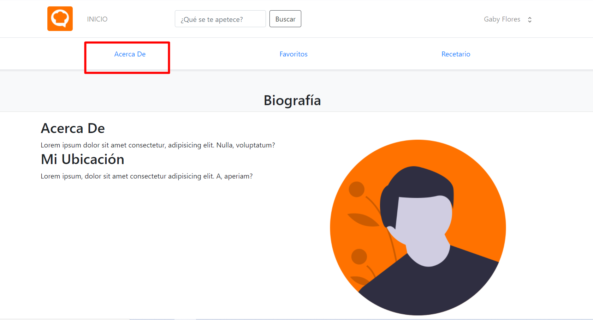
- Vista de favoritos (con las recetas que el usuario ha marcado como favoritas) 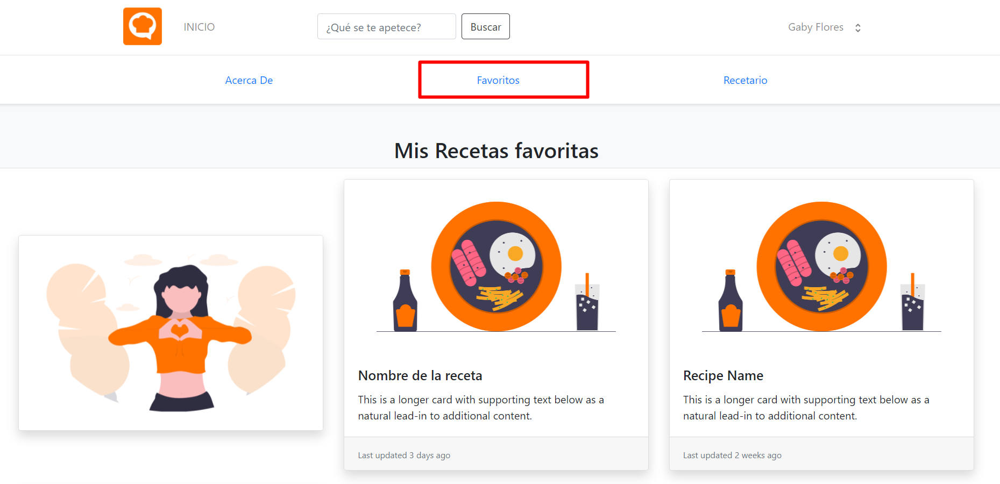
- Vista de recetario (donde se mostrarán las recetas que el usuario ha publicado)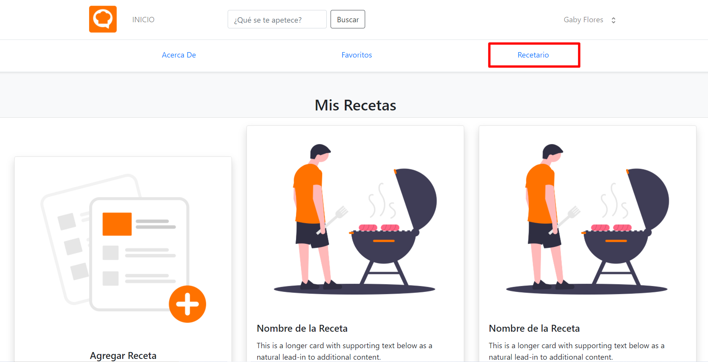

Para cerrar sesión:
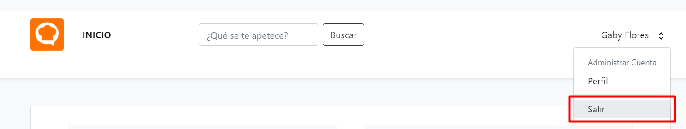

## PUBLICAR UNA RECETA
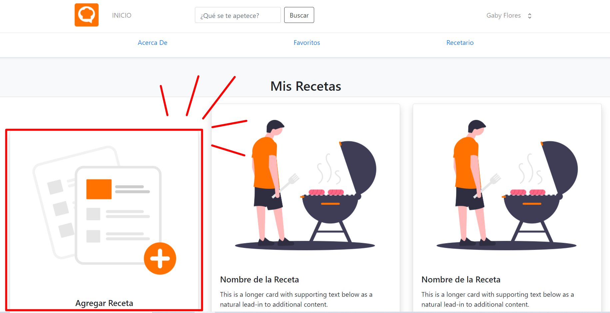
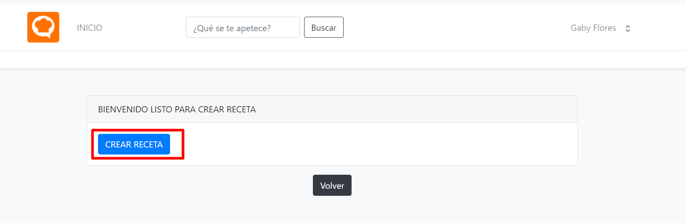
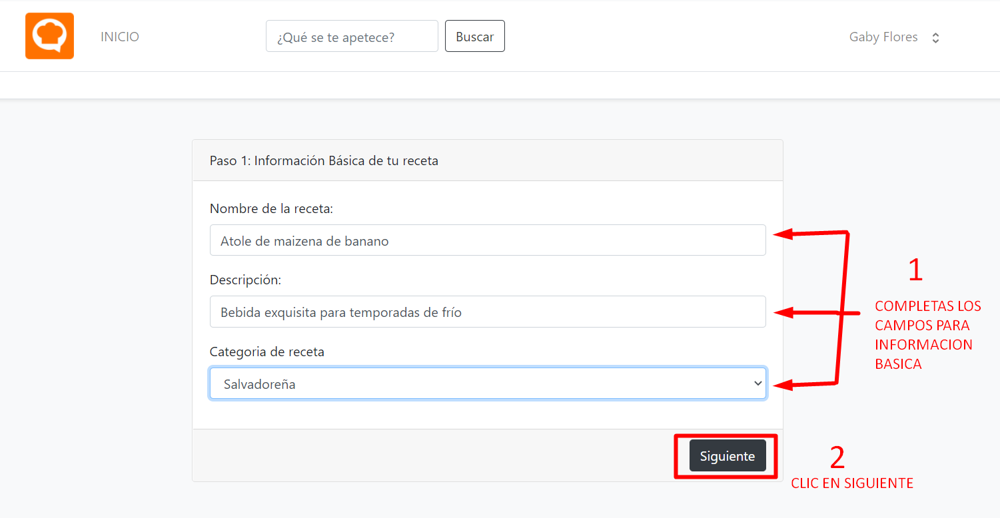
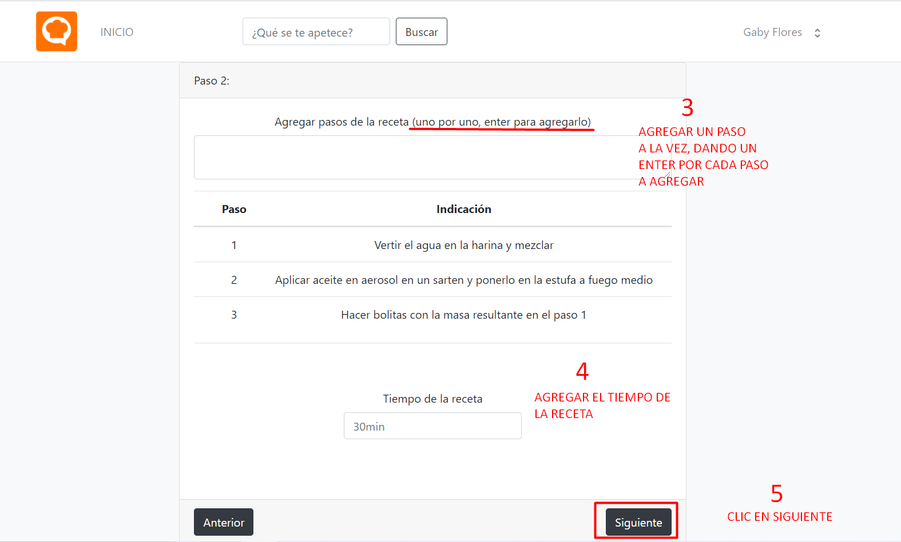
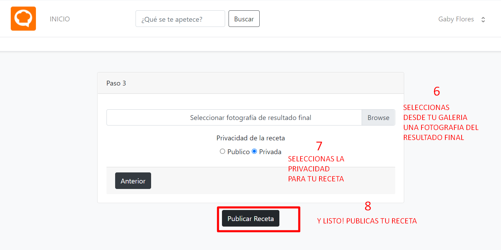

## Preguntas Frequentes (FAQ)
- [¿Cómo recupero mi contraseña si la olvidé?](https://www.youtube.com/watch?v=mLFF_NuOgV0)
- [¿Cómo puedo crear una cuenta para usar Talkfood?](https://www.youtube.com/watch?v=m0sgUd8U2qQ)
- [¿Cómo inicio sesión?](https://www.youtube.com/watch?v=4khdIKtRM7Y)
- [¿Cómo inicio sesión si ya tengo una cuenta?](https://www.youtube.com/watch?v=saJcYbLKyIU)
- [¿Cómo evito estar ingresando mis credenciales cada vez que quiero ingresar a Talkfood?](https://www.youtube.com/watch?v=8HUm5mBQMvA)
- ¿Puedo obtener una aplicación para mi móvil?

  No, actualmente Talkfood está desarrollado para funcionar en navegadores, no se cuenta con una aplicación para móviles como tal.
  
 - ¿Por qué no es válida la contraseña que intento poner al registrarme?
  
    Debes poner una contraseña que tenga como mínimo 8 caracteres.

 ¿Quiénes son los creadores de TalkFood? [Ir a página de los creadores](https://vasga-floze.github.io/manual-talkfood/about.html).

### Soporte o Contacto

¿Tienes problemas con TalkFood? Ponte en contacto con el servicio de asistencia técnica y te ayudaremos a solucionarlo.
